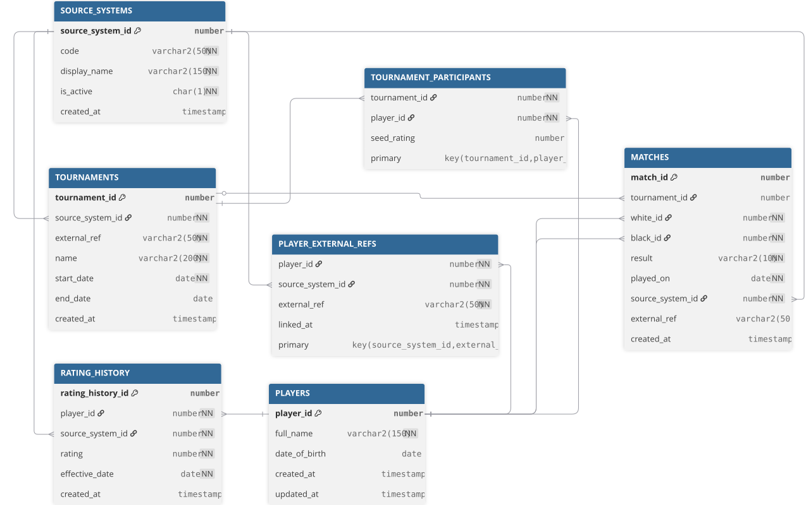

 ELO Insights Engine

Backend analytics engine that ingests player, match, and rating history data from external sources and computes performance insights — volatility, consistency, opponent strength, rating progression — exposed via a JSON API.

This is an analytics engine, not a rating calculator. Ratings are received from external sources (federations, clubs, online platforms, etc.); nothing in this project computes or derives a rating.

## Data model



Full schema: [`db/schema/01_core_schema.sql`](db/schema/01_core_schema.sql)

## Stack

- Oracle Database (FREE 26ai), PL/SQL
- Java 21, Spring Boot, Maven
- REST JSON API

## Project structure

```
db/
├── schema/     core DDL, tablespace/user setup
├── seed/       fictional sample data
└── queries/
    ├── identity/    finds merged and unresolved cross-system player identities
    └── insights/
        ├── scoring/    match-based analytics
        └── rating/     rating-based analytics
docs/           architecture and data model diagrams
src/            Spring Boot application
```

## Known limitations

- **Cross-source identity resolution**: Each rating source uses its own player reference, and they rarely share a common identifier. As a result, the engine cannot detect when two external records represent the same person. This reflects the real fragmentation across federations and platforms — even FIDE IDs don't fully unify identities.
- **Rating attribution**: rating updates store only an effective date, with no link to any match or tournament. A source could theoretically report per‑event, but even then there’s no way to confirm the previous update was contiguous, so the link isn’t reliable. For these reasons, rating attribution was deliberately left out of the schema.

## Setup

Schema setup assumes Oracle Database FREE running locally; adjust datafile paths in `db/schema/00_tablespace_and_user.sql` if using a different edition or install.

1. Run `db/schema/00_tablespace_and_user.sql` as a privileged user (creates the dedicated tablespace and schema)
2. Run `db/schema/01_core_schema.sql` connected as `elo_insights`
3. Run `db/seed/01_sample_data.sql` to load fictional sample data
4. Copy `src/main/resources/application.properties.example` to `application.properties` and fill in your database credentials
5. Run the Spring Boot application

## API

### Get a player
`GET /players/{playerId}`

Response:
```json
{"playerId":3,"fullName":"Lucía Fernández","dateOfBirth":"1995-07-22"}
```
Returns `404` if the player doesn't exist.

### Get a player's rating history
`GET /players/{playerId}/ratings`

Response:
```json
[
    {"playerId":3,"sourceSystemId":2,"rating":2061,"effectiveDate":"2026-04-06"},
    {"playerId":3,"sourceSystemId":5,"rating":2058,"effectiveDate":"2026-04-30"}
]
```

### Get a player's match history
`GET /players/{playerId}/matches`

Response:
```json
[
    {"matchId":2,"playerId":3,"opponentId":4,"colour":"BLACK","result":"WIN","playedOn":"2026-04-04","sourceSystemId":2,"tournamentId":2},
    {"matchId":3,"playerId":3,"opponentId":9,"colour":"WHITE","result":"DRAW","playedOn":"2026-04-05","sourceSystemId":2,"tournamentId":2}
]
```